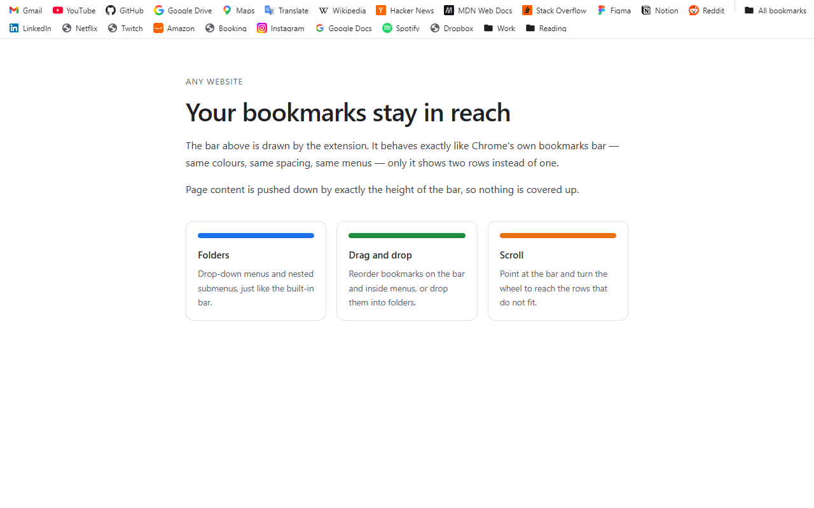
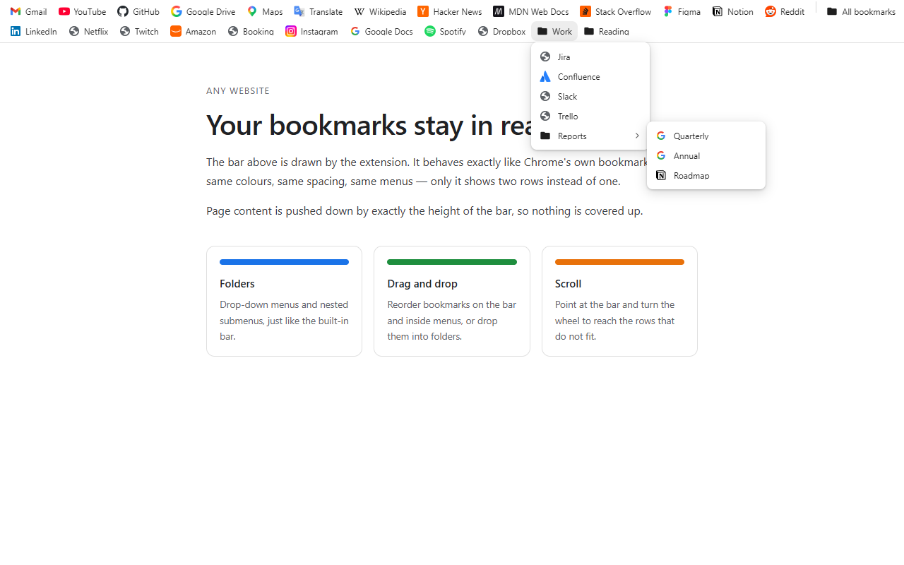
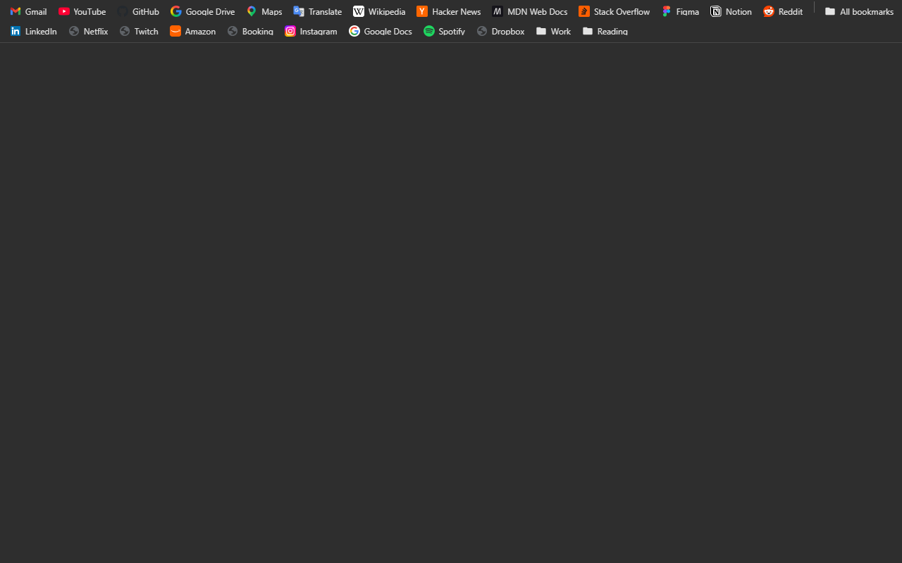

# Панель закладок в две строки

Расширение для Chrome, которое показывает закладки **в две строки** вместо одной —
внешне и по поведению неотличимо от встроенной панели.

**[Установить из Chrome Web Store](https://chromewebstore.google.com/detail/double-bookmarks-bar/emjahhnmlikkfcejoedmemmnjhcfnlln)**




---

## Установка

Из магазина:

1. Откройте [страницу расширения в Chrome Web Store][store] и нажмите
   **Установить**.
2. Скройте встроенную панель закладок: **Ctrl + Shift + B**.
3. Chrome один раз спросит «Вернуться к Google?» — расширение подменяет страницу
   новой вкладки. Нажмите **Оставить так**.

Всё. Панель появится вверху страниц — уже в две строки, с вашими закладками и
значками сайтов.

Из исходников (для разработки или чтобы поставить свою сборку):

1. Откройте `chrome://extensions` и включите **Режим разработчика**.
2. Нажмите **Загрузить распакованное расширение** и выберите папку с этим
   проектом. Готовый архив каждой версии лежит в [релизах][releases].
3. Дальше те же шаги 2–3, что и выше.

[store]: https://chromewebstore.google.com/detail/double-bookmarks-bar/emjahhnmlikkfcejoedmemmnjhcfnlln
[releases]: https://github.com/D-Shey/two-row-bookmarks-bar/releases

---

## Возможности

### Раскладка

- **1–4 строки** (по умолчанию две). Закладки заполняют строки слева направо и
  переносятся, как в настоящей панели.
- **Прокрутка колесом.** Наведите курсор на панель и крутите колесо — скрытые ряды
  закладок подтягиваются по одному ряду за щелчок. Когда панель дошла до края или
  скрывать нечего, дальше прокручивается страница, как обычно.
- Не поместившиеся уходят в меню **»**. Кнопка стоит в крайнем правом положении.
  При включённой прокрутке в этом меню перечислено то, что сейчас не видно, —
  и то, что выше текущих рядов, и то, что ниже; список обновляется при прокрутке.
- Справа — одна кнопка **«Все закладки»**, как в Chrome: диспетчер закладок,
  разделитель и содержимое папки «Другие закладки».
- Закладка без названия показывается **одним значком**, без URL — как в нативной
  панели. В выпадающих меню у неё выводится адрес без схемы (`example.com/path`).
- Длинные подписи обрезаются на 180 px — тот же предел, что у Chrome.

### Открытие

| Действие | Результат |
|---|---|
| Клик | текущая вкладка |
| Средняя кнопка, Ctrl + клик | фоновая вкладка |
| Ctrl + Shift + клик | новая активная вкладка |
| Shift + клик | новое окно |
| Средняя кнопка по папке | открыть всё содержимое фоновыми вкладками |

### Папки

Выпадающие меню с вложенными подменю без ограничения глубины. Подменю
переворачивается влево у края экрана, длинный список прокручивается и **никогда не
перекрывает кнопку**, которая его открыла. Наведение на соседнюю папку переключает
меню, как в Chrome. Работают стрелки ↑ ↓ → ←, Enter и Esc.

Меню закрывается повторным кликом по той же кнопке, кликом по пустому месту панели
или кликом в любой точке вне списка.

### Контекстное меню

**На закладке:** открыть в новой вкладке / новом окне / инкогнито · Изменить… ·
Вырезать · Копировать · Вставить · Удалить · Добавить страницу… · Добавить папку… ·
Диспетчер закладок · Показывать панель закладок · Настройки.

**На папке:** открыть все / все в новом окне / все в инкогнито · Переименовать… ·
Вырезать · Копировать · Вставить · Удалить · и далее то же самое.

### Перетаскивание

- Перестановка внутри панели и **внутри выпадающих меню**, включая вложенные.
- Бросок на середину папки кладёт закладку внутрь неё.
- Перетаскивание ссылки со страницы создаёт закладку.
- После перемещения меню остаётся открытым — восстанавливается вся цепочка меню
  вместе с позицией прокрутки.

### Страница новой вкладки



Расширение подменяет страницу новой вкладки собственной: пустой тёмный фон и та же
двухстрочная панель сверху. Это единственный способ показать закладки на новой
вкладке — на `chrome://newtab/` расширения не допускаются.

За её вид отвечает настройка **«Тёмная страница новой вкладки»** (по умолчанию
выключена):

- **выключена** — страница следует теме, как и все остальные: при теме «как у
  страницы / системы» — за настройкой системы;
- **включена** — и фон, и панель на этой странице тёмные, независимо от выбранной
  темы и от настройки системы.

Переключается на лету, без перезагрузки вкладки. Цвет фона — `--ntp-bg` в
`newtab/newtab.css`.

Поиск, ярлыки, карточки и фоновые картинки Chrome на ней не воспроизводятся: страница
намеренно пустая. Вернуть штатную новую вкладку можно, отключив расширение или убрав
`chrome_url_overrides` из `manifest.json`.

### Прочее

- **Буфер закладок.** Вырезать / Копировать / Вставить работают между окнами; папка
  копируется целиком со всем содержимым.
- **Отмена удаления.** После удаления всплывает «Отменить» и возвращает удалённое
  дерево полностью.
- **Живое обновление.** Любое изменение закладок — из диспетчера, с другого
  устройства, из другой вкладки — сразу перерисовывает панель во всех вкладках.
- **Значки сайтов** берутся из кеша Chrome (`chrome.favicon`), а не загружаются из
  сети.
- **Локализация:** русский и английский.

---

## Настройки

Значок расширения → **Настройки**, либо правый клик на панели → «Настройки панели
закладок…».

| Параметр | Значения |
|---|---|
| Показывать панель | вкл / выкл (также **Alt + Shift + B**) |
| Количество строк | 1–4 |
| Положение | сдвигать содержимое страницы вниз (как настоящая панель) · поверх страницы |
| Показывать при наведении на верхний край | вкл / выкл |
| Тема | как у страницы / системы · светлая · тёмная |
| Подписи | всегда · только у папок · только значки |
| Высота строки, размер шрифта, максимальная ширина элемента | ползунки |
| Кнопка «Все закладки» | вкл / выкл |
| Скрывать в полноэкранном режиме | вкл / выкл |
| Тёмная страница новой вкладки | вкл / выкл (по умолчанию выкл) |
| Прокручивать панель колесом | вкл / выкл (по умолчанию вкл) |
| Сайты-исключения | список хостов, по одному в строке |

Про тему: **«как у страницы / системы»** следует `prefers-color-scheme`, то есть
настройке ОС. Тему интерфейса Chrome можно задать отдельно в
`chrome://settings/appearance` — если они разойдутся, выберите «Светлая» или
«Тёмная» явно.

---

## Насколько точно совпадает

Сверялось не на глаз, а замером пикселей нативной панели рядом с этой.

Сравнительные снимки (нативная панель Chrome сверху, эта — снизу) снимались на
реальном профиле и в репозиторий не выкладываются.

| | светлая | тёмная (Chrome) | тёмная (здесь) |
|---|---|---|---|
| Фон панели | `#FFFFFF` | `#3C3C3C` | **`#2E2E2E`** |
| Текст | `#1F1F1F` | `#E3E3E3` | `#E3E3E3` |
| Фон меню | `#FFFFFF` | `#1F1F1F` | `#1F1F1F` |
| Разделитель в меню | `rgba(0,0,0,.16)` | `#5E5E5E` | `#5E5E5E` |
| Линия под панелью | `#E0E0E0` | `#474747` | `#474747` |

Высота строки 28 px, шрифт 12 px, значок 16 px, скругление 8 px — как у Chrome.

Намеренных отличий три:

1. Кнопка **»** стоит в крайнем правом положении, а Chrome ставит её перед
   разделителем и кнопкой «Все закладки».
2. Тёмный фон панели на две градации темнее нативного: `#2E2E2E` вместо `#3C3C3C`.
   Применяется и при теме «как у системы», и при явно выбранной «Тёмная». Чтобы
   вернуть точное совпадение, замените `--dbb-bg` в обоих тёмных блоках
   `content/bar.css` на `#3c3c3c`.
3. Страница новой вкладки пустая, без поиска и ярлыков Chrome. Тему она берёт
   общую; закрепить её тёмной независимо от темы можно в настройках.

---

## Ограничения

Chrome **не разрешает** расширениям менять собственный интерфейс браузера — превратить
настоящую панель закладок в двухстрочную нельзя никаким расширением. Эта панель
рисуется внутри страницы, отсюда следующее:

- **Не видна на служебных страницах**: `chrome://*` (настройки, история, диспетчер
  закладок), Интернет-магазин Chrome, страницы других расширений. Туда контент-скрипты
  не допускаются. Новая вкладка — исключение: она заменена своей страницей.
- **Букмарклеты (`javascript:`) не работают** — Manifest V3 запрещает расширениям
  выполнять произвольный код на странице. Расширение показывает об этом сообщение
  вместо тихого отказа.
- В режиме «сдвигать содержимое вниз» сайт с собственной липкой шапкой
  (`position: fixed; top: 0`) не сдвигается отступом страницы, поэтому расширение
  опускает такие шапки отдельно — ищет их пробами по верху окна и добавляет им
  верхний отступ в высоту панели. Это перекрывает обычный случай (YouTube, GitHub,
  почта), но остаётся два края: закреплённый блок, который целиком лежит ниже
  ~240 px от верха окна, найден не будет, а блок высотой в полное окно (подложка
  модального окна) уедет вниз на высоту панели и обрежется снизу. Если сайт
  всё-таки поехал — переключите режим на «поверх страницы» или добавьте сайт
  в исключения.
- Для пункта «Открыть в окне в режиме инкогнито» разрешите расширению работать в
  инкогнито на `chrome://extensions`.
- **Страницы, которые не могут уступить место, рисуются чуть мельче.**
  Google Таблицы, Документы и им подобные меряют высоту окна и расставляют свою
  обвязку от неё, а не от коробки документа. Отступ опустил бы такое приложение
  целиком, и нижние пиксели — в Таблицах там панель листов с кнопкой «Добавить
  лист» — ушли бы за край. Расширение это замечает и вместо сдвига уменьшает
  масштаб страницы ровно настолько, чтобы полное окно раскладки уместилось в
  остаток под панелью: при окне 945px это около 6%. Видно всё — и закладки, и
  меню сайта, и его нижняя полоса. Настраивать ничего не нужно, список сайтов
  нигде не зашит; обычных страниц и приложений, которые от сдвига корректно
  сжимаются (Яндекс.Карты), это не касается. Если окно настолько низкое, что
  масштаб ушёл бы ниже 0.8, панель вместо этого прячется и выезжает при
  наведении на верхний край.
- **В инкогнито панель есть на сайтах, но не на новой вкладке.** Chrome не даёт
  подменять страницу новой вкладки в окнах инкогнито — там всегда своя страница,
  и расширения на неё не допускаются. Это ограничение браузера, а не настройка:
  разрешение «Разрешить в инкогнито» включает панель на обычных страницах, но
  новую вкладку не затрагивает.

---

## Устройство

```
manifest.json                 Manifest V3
background/
  settings.js                 схема настроек, доступ к chrome.storage.sync
  service-worker.js           прокси к chrome.bookmarks / tabs / windows,
                              буфер закладок, отмена удаления,
                              рассылка изменений во все вкладки
content/
  content.js                  панель целиком: отрисовка, раскладка по строкам,
                              переполнение, меню, диалоги, drag & drop
  bar.css                     стили, живут в закрытом shadow root
newtab/                       страница новой вкладки: фон и тот же скрипт панели
popup/                        быстрый переключатель, «добавить эту страницу»
options/                      страница настроек
_locales/{en,ru}              строки интерфейса
icons/                        иконки расширения
store/                        материалы карточки Chrome Web Store:
                              скриншоты, промо-плитка, тексты полей
```

Панель живёт в **закрытом shadow root** внутри элемента `<dbb-bookmarks-bar>`:
стили страницы на неё не влияют, а скрипты страницы её не видят и не могут ей
управлять. Контент-скрипту недоступен `chrome.bookmarks`, поэтому все операции идут
через service worker, который принимает только белый список методов —
страница не может через расширение сделать с закладками ничего сверх того, что
делает сама панель.

Разрешения: `bookmarks`, `storage`, `tabs`, `favicon` и доступ к страницам для
внедрения панели. Никаких сетевых запросов расширение не делает.

---

## Разработка

Синтаксис проверяется так:

```bash
node --check content/content.js        # предварительно скопировав в .mjs
```

Для ручной проверки удобно поднять отдельный профиль Chrome, чтобы не трогать
рабочий:

```powershell
chrome.exe --user-data-dir=%TEMP%\dbb-profile --no-first-run
```

Дальше `chrome://extensions` → Режим разработчика → Загрузить распакованное.
После правок жмите «Обновить» на карточке расширения и перезагрузите страницу.
